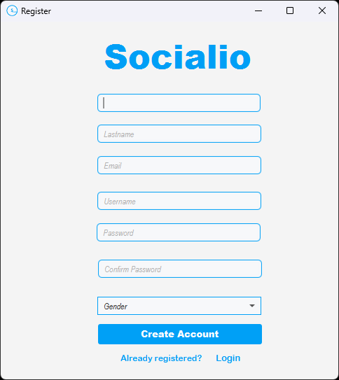

# Social_Network

Good afternoon, everyone, and thank you for joining me today for the presentation of my social network personal project. As a software developer, I have always been fascinated by the power of social media to connect people from all around the world. In developing this project, I had the opportunity to learn and apply my knowledge of software architecture and object-oriented programming to create a platform that is not only visually appealing but also efficient and scalable. My aim was to create a social network that is built on the solid foundation of sound software design principles, promoting a clean codebase and high maintainability. I'm excited to showcase the results of my efforts today, and share with you the features, the architecture, and the future roadmap of my project. So, without further ado, let's dive into the world of Socialio.

The application opens with the login window.

Each new person can register in a very simple way.

If a field is filled in incorrectly, the user receives a notification, and the account is not created.

Every password (both from the login and from the register) is encrypted with AES-CBC, with a key of 256.

After login, the feed page is opened.

In the search page, the logged user can search for other users using their username or their names.

He can see the profile of every found user. 
Profile with a default picture:

Personalized profile:

The logged user can send friend requests/cancel friend requests/accept friend requests/decline friend requests both from search page and from the profile of the other user.

The logged user can see his notifications.
User with 0 notifications:

User with one friend request:

User with two friend requests:

Friend requests and notifications update in real time using observer pattern.

The messages button will open the list with all conversations:

The logged user can search a friend, a person with a pending friend request or  a person with whom he has spoken in the past and send a message.

When the logged user press a conversation:

The logged user can send a message. If the message is sent, the logged user will see o:

If the message is received, the logged user will see oo:

If the message is seen, the logged user will see:

The logged users will know when they have an unseen message by the red message button:

Every user can see their own profile:

Every user can edit their own profile:

